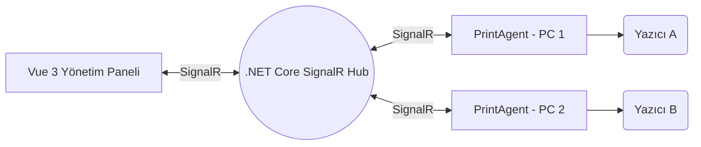

# PrintAgent & Merkezi Yönetim Sistemi

PrintAgent, merkezi bir sunucudan (SignalR aracılığıyla) gelen yazdırma komutlarını dinleyen ve istenilen belgeyi doğrudan hedef bilgisayarın yazıcılarına gönderen, 7/24 çalışacak şekilde tasarlanmış (Always-On) bir arka plan Windows servis uygulamasıdır. 

Bu depo (repository) sadece **PrintAgent** istemcisini değil, aynı zamanda sistemin nasıl çalıştığını tam olarak test edebilmeniz için **Merkezi SignalR Sunucusu (.NET Core)** ve **Yönetim Paneli (Vue 3)** örnek projelerini de barındırmaktadır.

---

## 🏗️ Sistem Mimarisi

Sistem 3 ana bileşenden oluşur:

1. **PrintAgent (Windows Client):** Yazdırma işlemini yapacak olan bilgisayara kurulan, arka planda çalışan ve doğrudan yazıcılara komut gönderen servis.
2. **ExamplePrintHub (SignalR Server):** Tüm PrintAgent'ların bağlandığı, onları dinleyen ve Vue uygulamasından gelen komutları ilgili ajanlara yönlendiren köprü (Hub) sunucu.
3. **ExampleVueClient (Web UI):** Tüm sisteme hakim olan kontrol paneli. Bağlı olan ajanları görür, ajanların yazıcı listesini çeker ve uzaktan yazdırma komutlarını tetikler.



---

## 🚀 PrintAgent Özellikleri (İstemci Tarafı)

- **Gelişmiş Format Desteği:** PDF (PdfiumViewer ile native), Resim dosyaları (.png, .jpg, .bmp, .gif - System.Drawing ile native ortalanmış çıktı), Word (.doc, .docx), Excel (.xls, .xlsx) ve Metin Dosyaları (.txt) destekler. Veri `Base64`, `URL` veya `Data URI` formatında gelebilir. Gelen verinin sihirli byte'larına (Magic Numbers) bakarak formatını dinamik olarak algılar, uzantısı eksik olsa dahi tespit edip native altyapı veya Windows `ShellExecute` ile arka planda sessizce yazdırır. Düz metinleri yanlışlıkla dosya olarak okumamak için akıllı karakter doğrulaması yapar.
- **Kopmaz Bağlantı (Auto-Reconnect):** SignalR üzerinden otomatik yeniden bağlanma stratejisi uygular. Manuel fallback döngüsü de mevcuttur.
- **Tekli Çalışma (Single Instance):** Mutex yapısı ile uygulamanın aynı bilgisayarda yanlışlıkla birden fazla kez açılması önlenir.
- **Hata Toleransı (Auto-Restart):** Kritik hatalarda (`UnhandledException`) çöküp yok olmak yerine sessizce kendi kendini yeniden başlatır.
- **Görsel Durum & Bildirimler:** Sistem tepsisinde (System Tray) bağlantı durumunu gösterir (Yeşil/Kırmızı). Yazdırma işlemleri Windows Balon Bildirimi olarak sağ alta düşer.
- **Fiziksel Loglama:** `Serilog` ile loglar disk üzerinde (`Logs/`) saklanır, 7 günlük rotasyon uygulanır.

---

## 🛠️ Kurulum ve Test (Örnek Projelerin Çalıştırılması)

Tüm sistemi kendi bilgisayarınızda ayağa kaldırmak ve test etmek için sırasıyla aşağıdaki adımları izleyin:

### 1. ExamplePrintHub (Merkezi Sunucu) Başlatılması
Vue uygulamasının ve Ajanların haberleşeceği .NET Web API projesidir.
1. Terminalde `ExamplePrintHub` klasörüne gidin.
2. `dotnet run` komutunu çalıştırın.
3. Sunucu `http://localhost:5200` portundan ayağa kalkacak ve `/printhub` endpoint'inde bağlantıları beklemeye başlayacaktır.

### 2. PrintAgent (İstemci) Başlatılması
Yazıcıların bulunduğu bilgisayarda (şu an test için kendi bilgisayarınızda) çalışacak ajandır.
1. Ana klasördeki `PrintAgent.csproj` uygulamasının ayarlarını `appsettings.json` dosyasından kontrol edin:
   ```json
   {
     "AgentSettings": {
       "ShowNotifications": true,
       "HubUrl": "http://localhost:5200/printhub",
       "AutoStart": false
     }
   }
   ```
2. Ana klasörde (veya Visual Studio üzerinden) projeyi çalıştırın (`dotnet run`).
3. Sağ alt köşede Windows tepsisinde (System Tray) **Yeşil ikon** belirdiğinde Ajan başarıyla sunucuya (Hub'a) bağlanmış demektir.

### 3. ExampleVueClient (Yönetim Paneli) Başlatılması
Yazıcıları listelemek ve yazdırma emri göndermek için kullanacağımız web arayüzüdür.
1. Terminalde `ExampleVueClient` klasörüne gidin.
2. Bağımlılıkları yüklemek için `npm install` komutunu çalıştırın.
3. Uygulamayı başlatmak için `npm run dev` komutunu çalıştırın.
4. Tarayıcınızda (genelde `http://localhost:5173`) uygulamayı açın.

### 🎯 Test Adımları
- Web ekranını açtığınızda **"Bağlı Ajanlar"** listesinde kendi bilgisayarınızın adını göreceksiniz.
- Ajanın üzerine tıkladığınızda SignalR üzerinden ajana istek gider ve o bilgisayardaki **Kurulu Yazıcıların Listesi** çekilir.
- Yazıcı seçimi yapıp, düz metin, Base64 formatında belge veya internetten indireceği bir PDF linki (URL) vererek **"Belgeyi Yazdır"** butonuna basın.
- PrintAgent belgenizi arka planda işleyecek ve seçtiğiniz yazıcıya (örneğin _Microsoft Print to PDF_ seçerek test edebilirsiniz) gönderecektir.
- İşlem bittiğinde başarılı/başarısız sonucu Web paneline anlık (Real-Time) olarak yansıyacaktır.

---

## 💻 Teknik Altyapı Notları

- **PrintAgent:** .NET 9.0 (Worker Service & WinForms melezi), SignalR Client, Serilog, PdfiumViewer.
- **ExamplePrintHub:** .NET 9.0 Web API, SignalR Server, CORS yapılandırması.
- **ExampleVueClient:** Vite, Vue 3, Composition API, `@microsoft/signalr`, Modern Glassmorphism CSS.

_Not: Proje içerisindeki örnek klasörleri (.NET derlemesinde çakışma olmaması için) ana `PrintAgent.csproj` içerisinden `<DefaultItemExcludes>` kullanılarak hariç tutulmuştur._
